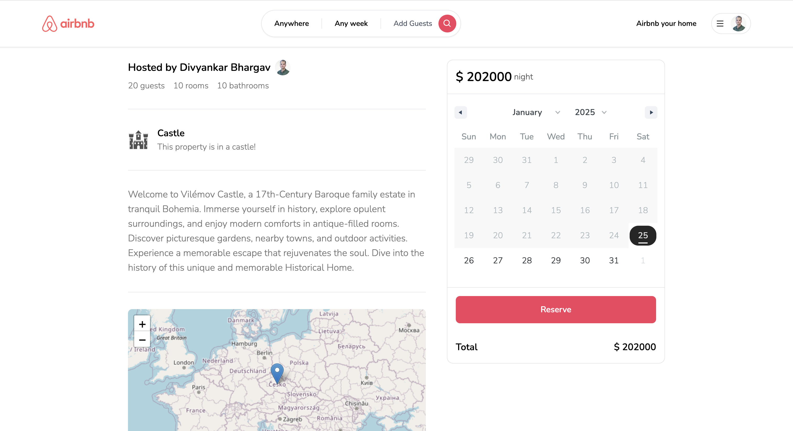
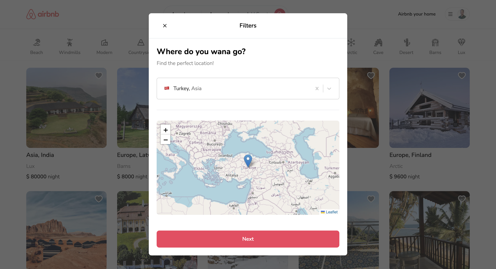
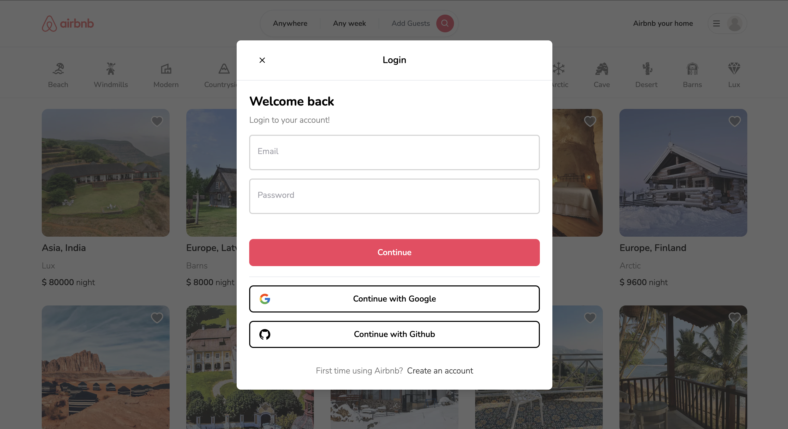
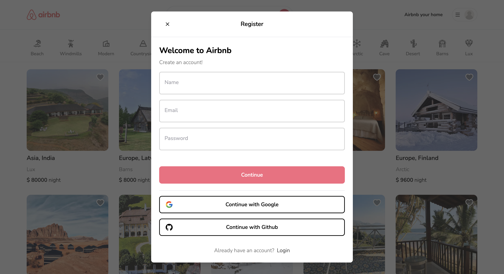
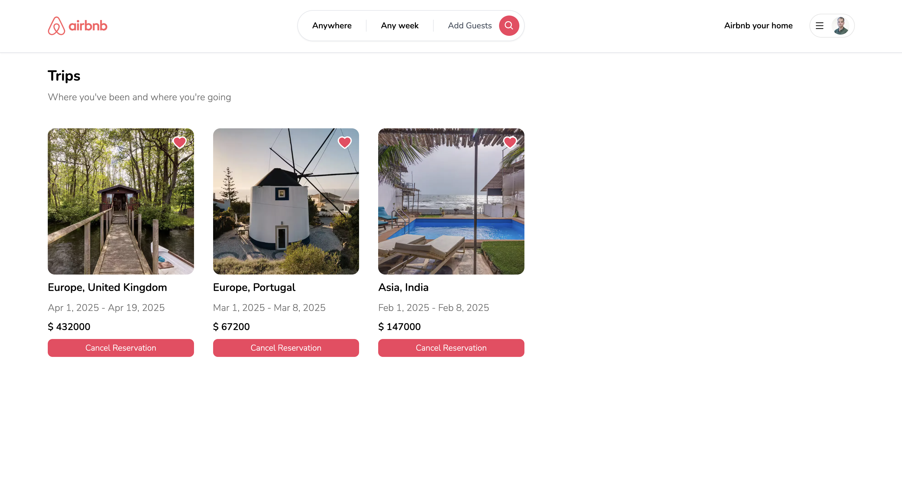
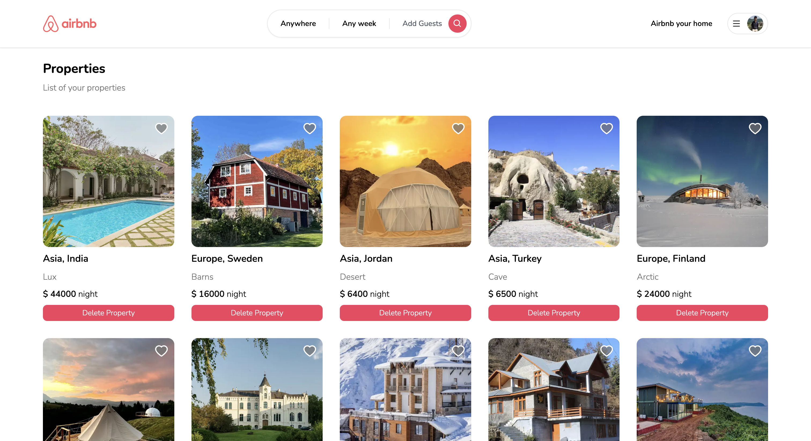
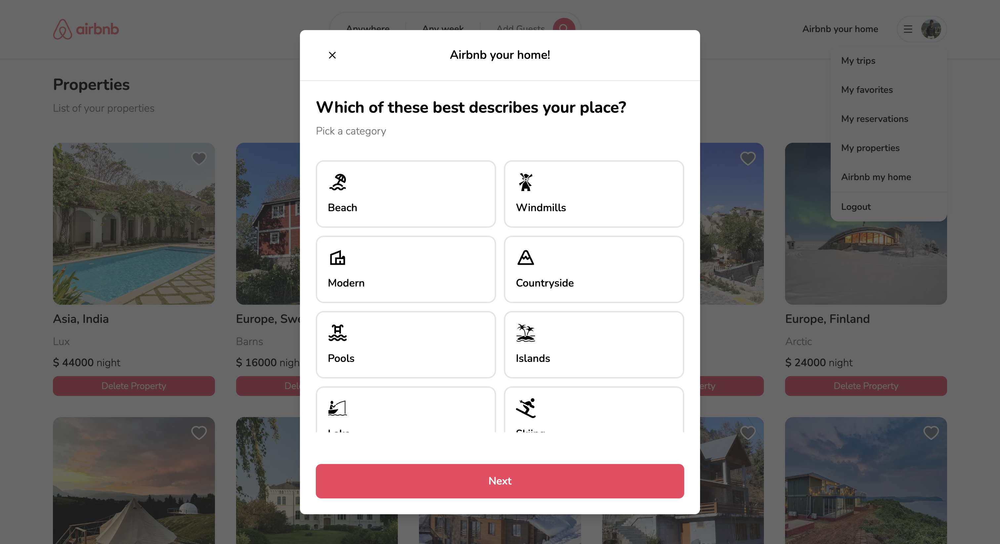

# 🏡 Airbnb Clone

   

 

This project is a full-stack Airbnb clone, offering key features to book and list properties. It's built with modern technologies and provides an intuitive user experience.

## 🌟 Features

### User Authentication

- **Login/Register** with:
  - Google
  - GitHub
  - Email/Password

### Property Listings

- Browse available **listings** with key details and filters.
- Apply **filters** to find properties by:
  - **Location**
  - **Duration**
  - **Number of Guests**
- Add new properties to the platform.

### Personalized Features

- **My Trips**: View all the trips you've booked.
- **My Favorites**: Manage properties you've marked as favorite.
- **My Properties**: View properties you've listed on the platform.
- **My Reservations**: See bookings made by others for your listed properties.

### Interaction

- Mark any property as a **favorite**.
- Reserve properties for trips with simple booking

## 🛠️ Technologies Used

- **Frontend**: Next.js, Zustand, Tailwind CSS
- **Backend**: Prisma with server events
- **Database**: MongoDB
- **Authentication**: Next Auth
- **Hosting**: Vercel
- **APIs**: Google & GitHub OAuth

## 🚀 Getting Started

### Prerequisites

Before you begin, ensure you have met the following requirements:

- Node.js and npm installed
- MongoDB database set up
- Google and GitHub OAuth credentials
- Cloudinary account for file storage

### Installation

1. **Clone the repository:**

```bash
git clone git@github.com:ScaryWings83289/airbnb.git
cd airbnb
```

2. **Install dependencies:**

```bash
yarn install
```

3. **Set up environment variables: Create a .env file in the root directory and add the following:**

```bash
DATABASE_URL=your-mongodb-connection-string
NEXTAUTH_SECRET=your-auth-secret
GITHUB_ID=your-github-client-id
GITHUB_SECRET=your-github-client-secret
GOOGLE_CLIENT_ID=your-google-client-id
GOOGLE_CLIENT_SECRET=your-google-client-secret
NEXT_PUBLIC_CLOUDINARY_CLOUD_NAME=your-cloudinary-bucket-name
```

4. **Run the application:**

```bash
yarn dev
```

5. **Access the app:** Open http://localhost:3000 in your browser.

## 📸 Screenshots

1. **Listing Page:**
   

2. **Property Details Page:**
   
   

3. **Property Listing with Filters**
   

4. **Login/Register**
   
   

5. **My Trips**
   

6. **My Properties**
   

7. **My Reservations**
   

8. **Add your property**
   

## 🤝 Developed With

- [Visual Studio Code](https://code.visualstudio.com/) - A source code editor developed by Microsoft for Windows, Linux and macOS. It includes support for debugging, embedded Git control, syntax highlighting, intelligent code completion, snippets, and code refactoring
- [Next.js](https://nextjs.org/) - The React Framework for the Web.
- [MongoDB](https://www.mongodb.com/) - MongoDB is a source-available, cross-platform, document-oriented database program. Classified as a NoSQL database product, MongoDB utilizes JSON-like documents with optional schemas.
- [Prisma](https://www.prisma.io/) - Prisma provides the best experience for your team to work and interact with databases. Even complex things like connection pooling, caching, real-time database subscriptions are a breeze with our products.
- [TailwindCSS](https://tailwindcss.com/) - A utility-first CSS framework packed with classes like flex, pt-4, text-center and rotate-90 that can be composed to build any design, directly in your markup.
